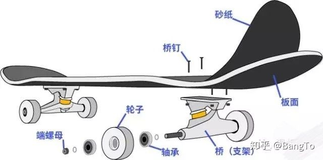
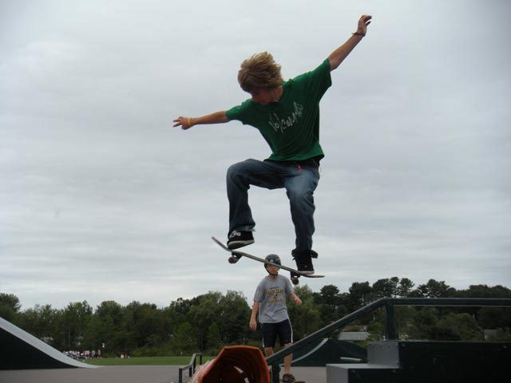
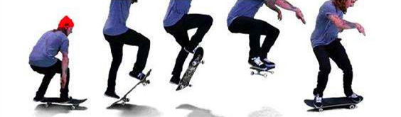
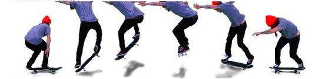

# Awesome-Skateboard

整理向，素材基本来源于网络，已注明出处，侵删。

## 1. 滑板知识

### 1.1 滑板构成

下图[1]所示为滑板的基本部件。

### 1.2 滑板选购

不推荐买整板，就是所有组件都是一个品牌的板，每个品牌都有它擅长的部分，建议选购组装板。目前而言，组装板全国产配置价位在300元左右，一般会优先考虑配上更好的支架，进阶配置在400到600元区间，所有组件全进口配置价格大致在700到1000元区间[1]。

**专业滑板品牌推荐[1]**

| 部件            | 品牌                                                         |
| --------------- | ------------------------------------------------------------ |
| 国产板面        | Shox, 崛起, BD, 引力CKLONE, Manner, BackMacket               |
| 进口板面-性价比 | Nomad, Droshky, Antiz, ToyMachine, Foundation                |
| 进口板面-高端   | Almost, Girl, Chocolate, Real, Flip, Zero, Baker, Enjoi, Deathwish, SantaCruz, Creature |
| 国产支架        | 引力                                                         |
| 进口支架        | Independent(被称为桥王, 软桥), Thunder(T桥, 中性偏软), Venture(V桥, 中性偏硬), Destructo(D桥, 硬桥), Theeve(钛合金, 偏软), Tensor(镁铝合金, 软桥), Krux(K桥, 硬桥), Royal(偏硬) |
| 进口轴承        | Ricta, OJ, 小火人, Bones, Crupie, PIG, Minilogo              |

[新人如何选购滑板](https://zhuanlan.zhihu.com/p/35539389)

[如何选购滑板？新人选购双翘的5建议](https://zhuanlan.zhihu.com/p/24748620)

## 2. Basic Tricks

### 2.1 荡板

### 2.2 Pivot

### 2.3 Manual

[[自制字幕]日本滑板入门基础教学4——Manual](https://www.bilibili.com/video/av27444867/?spm_id_from=333.788.videocard.1)

熟练的使用Manual还可以完成刹车以及掉头等动作。

### 2.4 Nose Manual

[[自制字幕]日本滑板入门基础教学5——Nose Manual](https://www.bilibili.com/video/av27444965/?spm_id_from=333.788.videocard.0)

### 2.5 横刹

[[自制字幕]日本滑板入门基础教学6——横刹](https://www.bilibili.com/video/av27445168/?spm_id_from=333.788.videocard.1)

### 2.6 Ollie

A trick wherein the skater kicks the tail of the skateboard downwards while jumping to make the skateboard pop into the air.

### 2.7 Frontside 180 外转

### 2.8 Backside 180 内转

### 2.9 Pop Shove-it 倒板

### 2.10 Front Shove-it

### 2.11 Heel Flip 跟翻

An aerial skateboarding trick in which the skater kicks out on its front and flip the board 360 degrees on the skateboard’s axis.

### 2.12 Kick Flip 尖翻

A skateboarding trick, where the skater did an ollie and kicks his foot out and and flip the skateboard 360 degrees on its axis with his toes which allows the skateboard to spin all the way, catches it and lands.

### 2.13 180 Flip 小乱

### 2.14 360 Flip 大乱

## 3. Combo Tricks

### 3.1 Pop Shove-it + Pivot + Manual 掉头

## Reference

[1] https://www.zhihu.com/question/323833031/answer/694771302